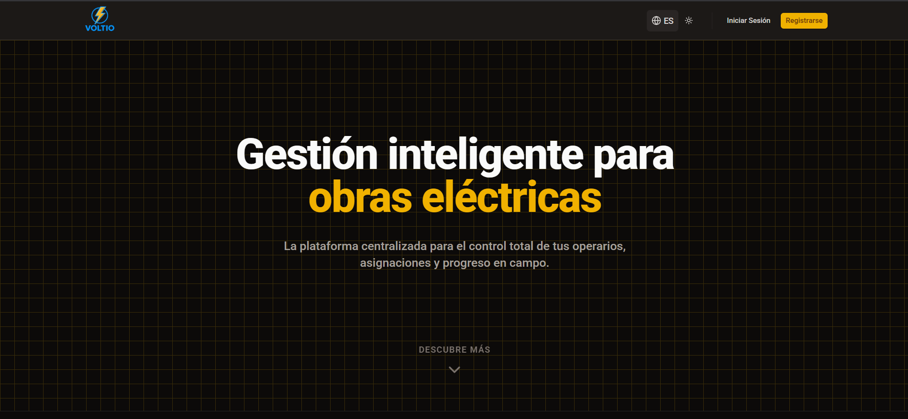

# ⚡ Voltio — Gestión operativa para el sector eléctrico

<p align="center">
  
  
  
  
</p>

> 🏗️ Voltio es una aplicación web final del ciclo Desarrollo de Aplicaciones Web.
> Permite a las empresas del sector eléctrico centralizar el control de obras activas, gestionar a los operarios y llevar un registro del inventario en tiempo real.

---

## 🌍 Descripción general

Voltio combina una arquitectura moderna y modular:
- 🔹 **Frontend:** React + Vite + TailwindCSS + Shadcn UI
- 🔹 **Base de datos y autenticación:** Supabase (PostgreSQL + Auth + Storage)
- 🔹 **Gestión de estado global:** Zustand
- 🔹 **Gestión de usuarios:** Login, roles (`admin`, `empleado`) y perfiles seguros mediante políticas RLS
- 🔹 **Diseño:** Limpio, oscuro, responsive y soporte multi-idioma (i18n)
- 🔹 **Objetivo:** Eliminar el uso de papel y optimizar la operativa de los equipos de campo

---

## 🚀 Despliegue

[](https://voltio-rho.vercel.app/)

Accede a la versión en producción: https://voltio-rho.vercel.app/



---

## 🧱 Estructura del proyecto

```bash
Voltio/
│
├── public/               # Recursos estáticos (logo.png, preview.png)
│
├── docs/                 # Documentación del proyecto (manuales y diagramas)
│
├── src/
│   ├── components/       # Componentes UI reutilizables (Shadcn, modales, formularios)
│   ├── layouts/          # Estructuras maestras (MainLayout, MainSidebar)
│   ├── locales/          # Archivos de internacionalización (es.json, en.json)
│   ├── pages/            # Dashboard, Obras, Inventario, Login, Registro, etc.
│   ├── stores/           # Estado global modular con Zustand
│   ├── Supabase/         # Configuración del cliente backend
│   ├── App.tsx           # Enrutamiento principal y protección de rutas
│   ├── main.tsx          # Entrada de React
│   └── index.css         # Estilos globales Tailwind
│
├── .env.local            # Variables locales (NO se sube)
├── package.json
├── tailwind.config.js
├── eslint.config.js
├── vercel.json           # Configuración de despliegue para Vercel
└── README.md
```

---

## ⚙️ Instalación y ejecución local

### 1️⃣ Clonar el repositorio

```bash
git clone [https://github.com/reeeyy05/Voltio.git](https://github.com/reeeyy05/Voltio.git)
cd Voltio
```

### 2️⃣ Instalar dependencias

```bash
npm install
```

### 3️⃣ Ejecutar el entorno de desarrollo

*(Requiere configurar el archivo `.env.local` con las variables de Supabase)*

```bash
npm run dev
```

El proyecto se abrirá en: http://localhost:5173

---

## 🗄️ Base de datos (Supabase)

Tablas principales:

| Tabla | Descripción |
| :--- | :--- |
| **perfiles** | Datos extendidos del usuario (nombre, avatar, rol), vinculada a `auth.users` |
| **obras** | Proyectos activos de la empresa, con estados ("Pendiente", "Finalizada") |
| **tareas** | Asignaciones específicas dentro de una obra vinculadas a un operario |
| **materiales** | Catálogo general de stock para el control del almacén |

**Políticas RLS:**
- Cada operario solo accede y modifica la información de sus propios proyectos asignados.
- Los administradores tienen permisos globales de gestión (CRUD completo).

---

## 👤 Roles de usuario

| Rol | Permisos |
| :--- | :--- |
| **Administrador** | Acceso total. Crea y supervisa obras, visualiza gráficos globales, gestiona usuarios/roles y realiza carga masiva de stock CSV. |
| **Empleado** | Usuario de campo. Consulta sus obras asignadas, marca tareas como finalizadas y puede visualizar/modificar el inventario general. |

---

## 🧠 Tecnologías principales

| Tecnología | Uso |
| :--- | :--- |
| ⚛️ **React + Vite** | Frontend moderno, rápido y tipado con TypeScript |
| 🎨 **TailwindCSS** | Estilos consistentes, adaptables y modo oscuro nativo |
| 🧰 **Supabase** | Backend con PostgreSQL, Auth y Storage |
| 🐻 **Zustand** | Gestión del estado global estructurada y ligera |
| 📊 **Recharts** | Generación de gráficos analíticos interactivos |

---

## 💻 Comandos útiles

| Acción | Comando |
| :--- | :--- |
| Instalar dependencias | `npm install` |
| Ejecutar en desarrollo | `npm run dev` |
| Build de producción | `npm run build` |
| Previsualizar build | `npm run preview` |

---

## 🧩 Características implementadas

- ✅ Vistas: inicio, login, registro, dashboard, obras, tareas, inventario, gestión de usuarios
- ✅ Navegación con React Router y rutas protegidas
- ✅ Componentes reutilizables (Layouts, modales, tablas de Shadcn UI)
- ✅ Estilo responsive con modo oscuro e internacionalización (ES/EN)
- ✅ Supabase con RLS y roles (`admin`, `empleado`)
- ✅ Panel interactivo con gráficos de rendimiento (Recharts)
- ✅ Carga masiva de inventario mediante archivos CSV

---

| Vista | Descripción |
| :--- | :--- |
| 🏠 **Inicio** | Presentación del proyecto y características (Landing Page) |
| 🔐 **Login / Registro** | Acceso y autenticación de empleados y administradores |
| 📊 **Panel (Dashboard)** | Seguimiento de obras y gráficos de carga de trabajo |
| 🏗️ **Obras** | Gestión completa de proyectos (CRUD) y estados |
| 📝 **Detalle de Obra** | Asignación y gestión de tareas a operarios |
| 📦 **Inventario** | Control de stock, búsqueda y carga masiva por CSV |
| ⚙️ **Administración** | Gestión de usuarios, roles y actualización de datos |

---

## 📅 Cronograma de Desarrollo

Planificación estratégica basada en hitos clave:

| Fecha | Hito de Desarrollo |
| :--- | :--- |
| **12-Sept** | Presentación de Asignatura y Proyecto |
| **19-Sept** | Creación de Imagen Corporativa |
| **26-Sept** | Recogida de Necesidades y Elaboración de Contrato |
| **03-Oct** | Definición de Requisitos Funcionales y No Funcionales |
| **10-Oct** | Desarrollo de las Interfaces Gráficas |
| **17-Oct** | Desarrollo de la Estructura de la Base de Datos |
| **24-Oct** | Definición de **Modelo Relacional de la Base de Datos** |
| **31-Oct** | Presentación de Interfaces y BD a la Empresa |
| **07-Nov** | Elección de Tecnologías (React & Supabase) |
| **12-Dic** | Evaluación de Opciones de Despliegue |
| **19-Dic** | Pruebas de Despliegue en Entorno Local (TomCat) |
| **09-Ene** | Pruebas de Despliegue en **Vercel** |
| **16-Ene** | Creación **README** de presentación |
| **23-Ene** | Preparación para el futuro sobre el **Manual de Usuario** |
| **30-Ene** | Preparación para el futuro sobre el **Manual Técnico** |
| **6-Feb** | Manual de Despliegue |
| **27-Feb** | Implementación de Carga Masiva (CSV) en Inventario |
| **15-Mar** | Configuración de Gráficos (Recharts) en Dashboard |
| **10-Abr** | Refactorización de Estado Global (Zustand) y persistencia (F5) |
| **05-May** | Auditoría y ajuste de Políticas RLS de Supabase |
| **23-May** | Redacción Final del **Manual Técnico** y revisión de código |

---

## 👩‍💻 Autoría

- Alejandro Rey Tostado
- Desarrollo de Aplicaciones Web (DAW)
- 📍 IES Albarregas – Mérida (España)
- 📘 Proyecto TFG: Voltio – Gestión operativa para el sector eléctrico (2026)
